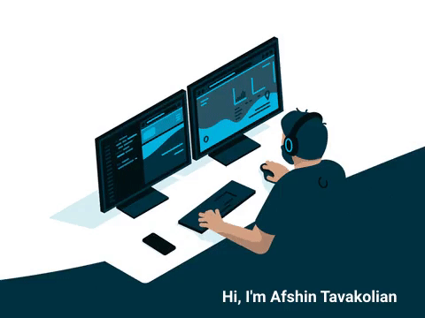

<a href="http://afsh7n.ir">
    
</a>

[](https://afsh7n.ir)
[](https://t.me/afsh7n)
[](https://api.whatsapp.com/send?phone=989051336889)
[](https://www.linkedin.com/in/afsh7n)
[](mailto:afsh7n@gmail.com)

Hey there 👋

I am Afshin, a software engineering student and backend programmer, who is very interested in learning new programming and technologies.

```go
whoAmI := map[string]interface{}{
	"name":            "Afshin Tavakolian",
	"profession":      "Software Engineer , Backend Developer",
	"location":        "Iran",
	"university":      "Imam Khomeini University of Technology",
	"currentPosition": "Freelancer",
	"languages":       []string{"PHP" , "Javascript" , "Typescript"},
	"frameworks":      []string{"Laravel" , "ExpressJS" , "Nodejs" , "VueJs"},
	"databases":       []string{"MySQL", "MongoDB" , "Redis" , "PostgreSQL"},
	"tools":           []string{"Git" , "Docker"},
	"systems":         []string{"Linux"},
}
``` 
## Statistics
<p align = "center">
  
  
</p>